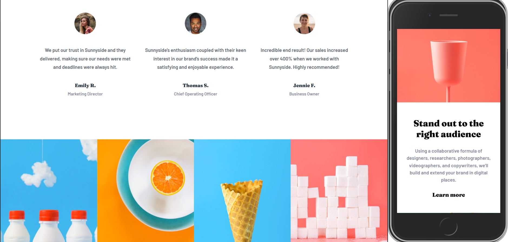

# Frontend Mentor - Sunnyside agency landing page solution

This is a solution to the [Sunnyside agency landing page challenge on Frontend Mentor](https://www.frontendmentor.io/challenges/sunnyside-agency-landing-page-7yVs3B6ef). Frontend Mentor challenges help you improve your coding skills by building realistic projects.

## Table of contents

- [Overview](#overview)
  - [The challenge](#the-challenge)
  - [Screenshot](#screenshot)
  - [Links](#links)
- [My process](#my-process)
  - [Built with](#built-with)
  - [What I learned](#what-i-learned)
  - [Continued development](#continued-development)
  - [Useful resources](#useful-resources)
- [Author](#author)

**Note: Delete this note and update the table of contents based on what sections you keep.**

## Overview

### The challenge

Users should be able to:

- View the optimal layout for the site depending on their device's screen size
- See hover states for all interactive elements on the page

### Screenshot

### Links

- Solution URL: [CODE](https://github.com/SinisaVukmirovic/FrontEnd-Mentor-challenge-6)
- Live Site URL: [DEMO](https://front-end-mentor-challenge-6-phi.vercel.app/)

## My process

### Built with

- ASTRO SSG

### What I learned

- Learning Astro in this project! Made many mistakes, didn't plan things out correctly... but... kinda works...

### Continued development

- Continue learning Astro

### Useful resources

- [Astro Docs](https://docs.astro.build/en/getting-started/) - Official Astro documentation
- [Astro crash course, by CiP](https://www.youtube.com/watch?v=zrPVTf761OI) - Coding in public's Astro crash course.
- [Astro crash course, by Trav](https://www.youtube.com/watch?v=Oi9z5gfIHJs) - Coding in public's Astro crash course.
- [Astro Blog course playlist](https://www.youtube.com/watch?v=F2pw1C9eKXw&list=PLoqZcxvpWzzeRwF8TEpXHtO7KYY6cNJeF) - Coding in public's Astro Blog course.

## Author

- Website - [Sinisa Vukmirovic](https://github.com/SinisaVukmirovic)
- Frontend Mentor - [@SinisaVukmirovic](https://www.frontendmentor.io/profile/SinisaVukmirovic)
- Twitter - [@sajtowski](https://twitter.com/sajtowski)
